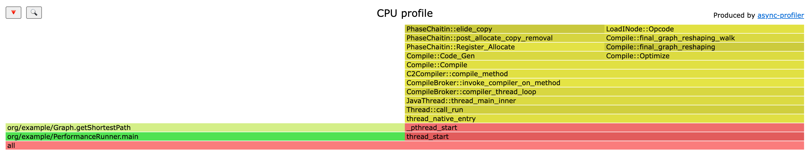
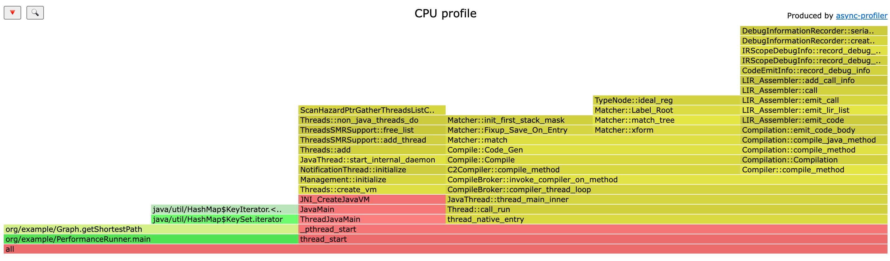
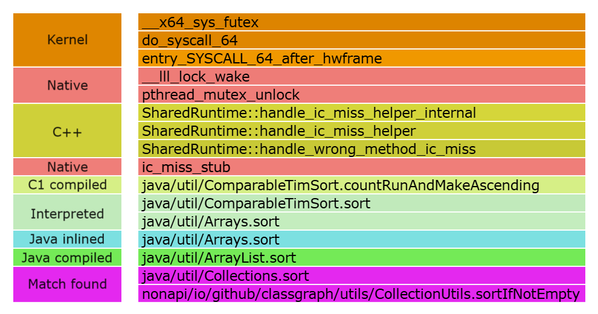

# Лабораторная работа № 1

Профилирование и тестирование производительности

## Описание
В данной лабораторной работе студентам предстоит реализовать один из изученных на предыдущих курсах алгоритмов или структур данных и выполнить анализ производительности полученного решения, а также серию оптимизаций алгоритма с точки зрения потребления памяти, ресурсов процессора и jit-а.

## Рассматриваемый алгоритм
В рамках работы был реализован и проанализирован следующий алгоритм:
- алгоритм Дейкстры.

Алгоритм Дейкстры находит кратчайший путь в графе с неотрицательными весами. 

Основные шаги:

1. Инициализация расстояний: стартовая вершина — 0, остальные — бесконечность.
2. Использование приоритетной очереди для выбора вершины с минимальным расстоянием.
3. Обновление расстояний до соседей через текущую вершину.
4. Повторение, пока не обработаны все достижимые вершины.

Реализация в коде:

1. Класс Vertex хранит ID и расстояние, реализует Comparable для очереди.
2. Graph содержит вершины и рёбра. Метод getShortestPath реализует алгоритм:
    distances — текущие минимальные расстояния. previous — для восстановления пути.
3. Приоритетная очередь nodes выбирает вершины по минимальному расстоянию.

## Профили CPU и аллокаций
Для проверки выдвинутых в отношении каждого алгоритма гипотез с помощью [async-profiler](https://github.com/async-profiler/async-profiler.git) были собраны их профили по использованию CPU и выделениям памяти. Сэмплирование осуществлялось с шагом в 100 наносекунд.

В файле сборки build.gradle была добавлена таска
```
task profile(type: JavaExec) {
    classpath = sourceSets.main.runtimeClasspath
    main = 'org.example.PerformanceRunner'
    jvmArgs = [
            "-agentpath:path/to/async-profiler/build/lib/libasyncProfiler.dylib=start,event=cpu,file=profile.html"
    ]
}
```
В этой таске происходит следующее:

1. Запуск JVM: JVM запускается и загружает ваш класс PerformanceRunner.
2. Подключение async-profiler: Агент async-profiler подключается к JVM и начинает собирать данные о работе приложения (в данном случае — использование CPU).
3. Выполнение кода: Код в классе PerformanceRunner выполняется, и async-profiler собирает данные о том, какие методы и как часто вызываются, сколько времени они занимают и т.д.
4. Сохранение результатов: После завершения работы приложения (или через указанное время) async-profiler сохраняет результаты профилирования в файл profile.html.
5. Анализ результатов: Ниже представлен profile.html. Файл содержит визуализацию (графы, таблицы), которая помогает понять, где находятся узкие места в коде.





Расшифровка цветов:



## JMH

Для JMH был добавлен отдельный блок кода в build.gradle

```
jmh {
    includes = ['.*'] // Запускать все бенчмарки
    profilers = ['async'] // Использовать async-profiler
    warmupIterations = 5 // Количество итераций для разогрева
    iterations = 10 // Количество итераций для измерения
    fork = 1 // Количество форков

    jvmArgs= [
            "-Djava.library.path=/path/to/async-profiler/build/lib",
            "-agentpath:/path/to/async-profiler/build/lib/libasyncProfiler.dylib=start,event=cpu,file=profile2.html"
    ]

}
```

## Идентифицированные проблемы в коде

1. Неэффективное обновление очереди:
    Поиск вершины в очереди за O(n) для обновления расстояния. Вместо этого можно добавлять новую вершину и игнорировать устаревшие при извлечении.
2. Отсутствие проверки актуальности расстояния:
   Извлечённые вершины могут иметь устаревшие расстояния, что приводит к лишним операциям.


## Вывод
В процессе выполнения работы был реализован, применен и проанализирован алгоритм Дейкстры. Анализ среднего времени выполнения, профилей CPU и профилей аллокаций позволил убедиться в верности или неверности предварительно выдвинутых гипотез о вычислительной сложности, структуре вызовов и задействовании памяти алгоритмом.